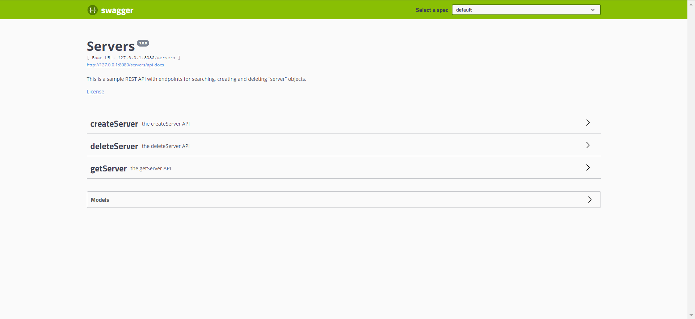
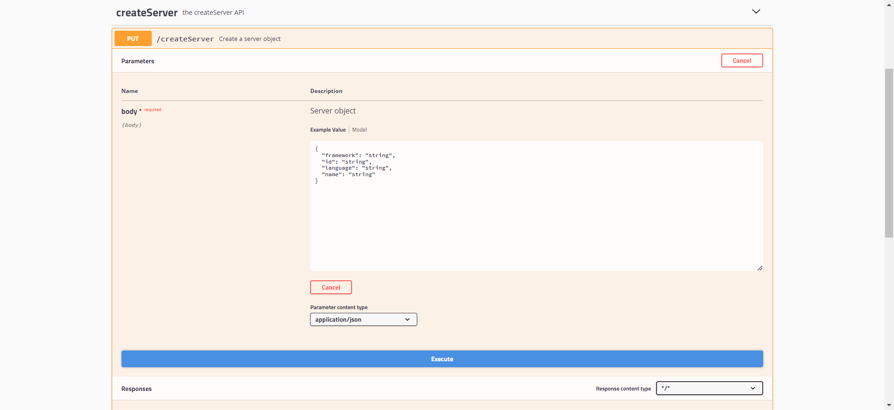
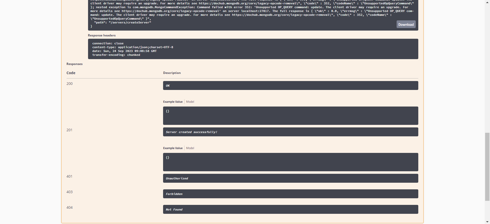
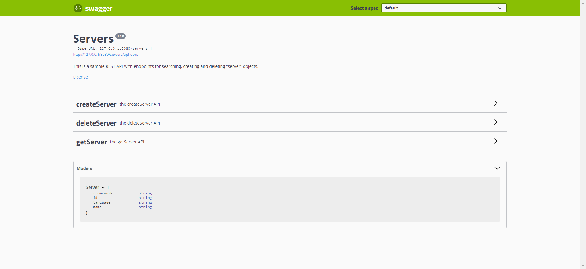
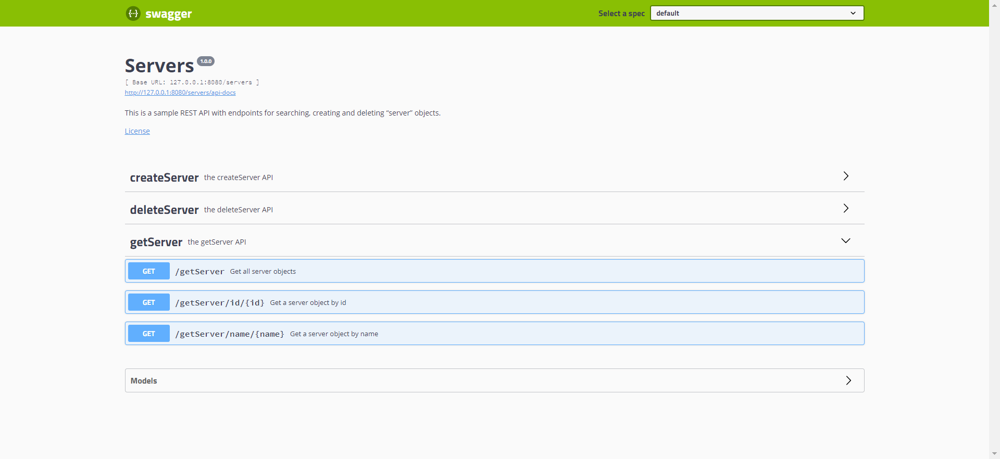
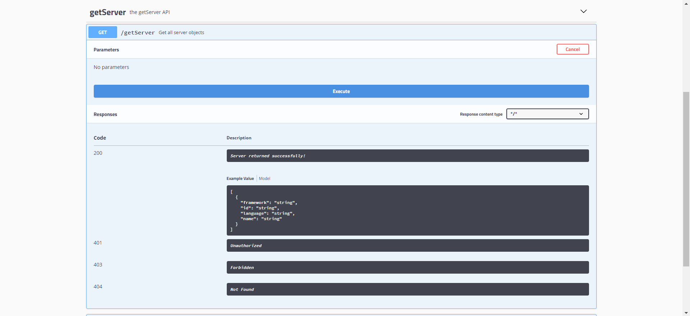
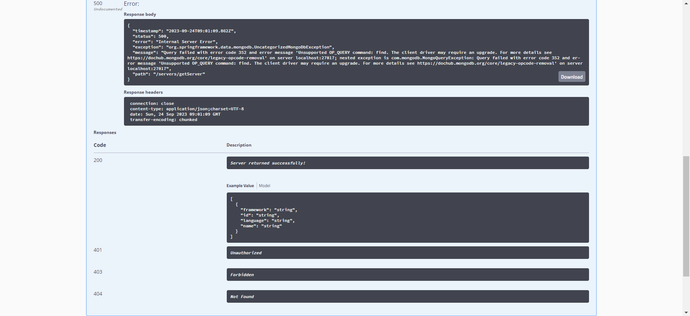
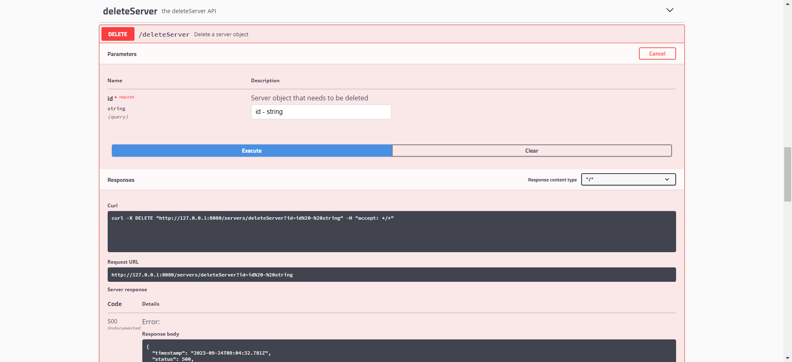
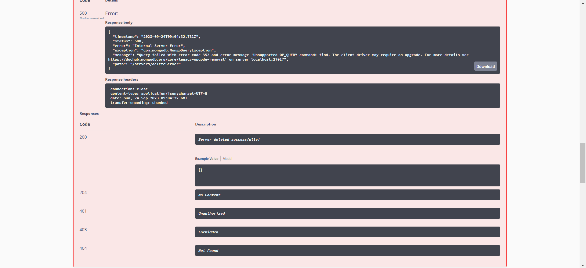

# Task 2: Swagger Codegen

This README provides instructions and documentation for creating a REST API in Java using Swagger Codegen. The API will have endpoints for searching, creating, and deleting "server" objects, and the data will be stored in a MongoDB database. The following sections provide an overview of the project along with screenshots of key features.

## Overview

In this task, we implemented a REST API that replicates the functionality described in Task #1. The API allows you to perform the following actions on "server" objects:

- Retrieve all servers or a single server by ID.
- Create a new server.
- Delete a server by its ID.
- Search for servers by name.

The application is based on a Java-based server framework and uses MongoDB as the database to store "Server" objects.

## Screenshots

### Landing Page

### Create Server

### Created Server

### Get Server

### Delete Server

## Prerequisites
- Java Development Kit (JDK) installed
- MongoDB installed and running
- An HTTP client such as Postman or cURL for testing API endpoints

## Setup

1. **Swagger Definition**: Create the API definition using [https://editor.swagger.io/](https://editor.swagger.io/). Save the Swagger YAML file.

2. **Generate Server Code**: Generate the server code using Swagger Codegen, either using the online editor or manually following the [How-To Guide](https://github.com/swagger-api/swagger-codegen/wiki/server-stub-generator-howto). Choose a Java-based server framework.

## Implementation

3. **Endpoint Implementation**: Implement the API endpoints in the generated code to match Task #1 requirements. Implement the following endpoints:

   - `GET /servers`: Return all servers if no parameters are passed. Return a single server or 404 if a server ID is passed.
   - `PUT /servers`: Create a server using a JSON-encoded message body.
   - `DELETE /servers/{id}`: Delete a server by its ID.
   - `GET /servers/find-by-name/{name}`: Find servers by name and return one or more servers found. Return 404 if nothing is found.

4. **MongoDB Integration**: Implement code to store and retrieve "Server" objects in a MongoDB database. Handle the database connection and CRUD operations.
